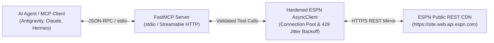

<!-- mcp-name: io.github.christianclaudio/espn -->

# 🏈 mcp-server-espn

[](https://github.com/christianclaudio/mcp-server-espn/actions/workflows/ci.yml)
[](https://pypi.org/project/mcp-server-espn/)
[](https://pypi.org/project/mcp-server-espn/)
[](https://opensource.org/licenses/Apache-2.0)
[](https://github.com/christianclaudio/mcp-server-espn)
[](https://coderabbit.ai)

> **Enterprise-grade Model Context Protocol (MCP) server for live and historical sports analytics, consensus betting odds, and predictions via ESPN.**  
> Equips AI agents with real-time sports intelligence, live win probabilities, in-depth boxscore statistics, roster hierarchies, and matchup analytics.

---

## ⚠️ Disclaimers & Fair Use Notice

> [!IMPORTANT]
> **Community Project Disclaimer**  
> `mcp-server-espn` is an independent open-source community project. It is **not** affiliated with, sponsored by, endorsed by, or supported by ESPN Inc. or The Walt Disney Company. *"ESPN"* is a trademark of ESPN Inc. All data provided via ESPN's public REST endpoints is intended for educational, research, and personal non-commercial use.

---

## 💡 Why This Exists

Autonomous sports analysis requires high-velocity, structured, and resilient data feeds:
1. **Live Game State & Win Probability:** Real-time game events (turnovers, scoring plays, pitching changes) shift momentum and expected outcomes dynamically.
2. **Key Player Injuries & Depth Chart Swaps:** An in-game injury or substitution fundamentally alters team efficiency and tactical matchups.
3. **Consensus Odds & Predictive Models:** Aggregating consensus sportsbook lines (DraftKings, Caesars, ESPN BET) alongside predictive metrics (FPI, BPI) powers deep statistical game evaluations.

`mcp-server-espn` provides a unified, hardened Model Context Protocol interface directly to ESPN's public sports data endpoints.

---

## 🏟️ System Architecture



---

## 📈 Sports Intelligence Workflows

### Workflow 1: Live In-Game Win Probability & Injury Impact
1. **Poll Active Games:** Agent calls `get_scoreboard(sport="football", league="nfl")` to identify close games in the 2nd half.
2. **Fetch Matchup Predictor & Injuries:** Call `get_game_summary(sport="football", league="nfl", event_id="401547432")` to retrieve ESPN's live win probability curve, consensus spread, and active injury reports.
3. **Inspect Player Boxscore Metrics:** Use `get_player_stats(sport="football", league="nfl", event_id="401547432")` to analyze key individual performances (passing yards, completion rates, defensive stops).

### Workflow 2: Pre-Game Roster & Depth Chart Matchup Preview
1. **Analyze Lineups:** Call `get_team_depth_chart(sport="baseball", league="mlb", team_id="10")` to verify probable starters and positional depth.
2. **Review Recent Momentum:** Pull `get_team_schedule(sport="baseball", league="mlb", team_id="10")` and `get_standings(sport="baseball", league="mlb")` to evaluate streaks and divisional standing.
3. **Compare Consensus Betting Lines:** Query `get_game_summary` to evaluate consensus moneyline and over/under spreads across major sportsbooks.

---

## 🏟️ Supported Sports & Leagues Reference Matrix

The server supports canonical sport/league slug pairs and auto-normalizes popular shortcuts:

| Sport Slug | League Slug | Recognized Shortcuts / Aliases | Common Display Name |
| :--- | :--- | :--- | :--- |
| `football` | `nfl` | `nfl` | National Football League |
| `football` | `college-football` | `cfb`, `ncaa-football`, `fbs` | NCAA College Football |
| `basketball` | `nba` | `nba` | National Basketball Association |
| `basketball` | `mens-college-basketball` | `cbb`, `ncaa-basketball` | NCAA Men's College Basketball |
| `basketball` | `womens-college-basketball` | `wbb`, `ncaa-womens-basketball` | NCAA Women's Basketball |
| `basketball` | `wnba` | `wnba` | Women's National Basketball Association |
| `baseball` | `mlb` | `mlb` | Major League Baseball |
| `hockey` | `nhl` | `nhl` | National Hockey League |
| `soccer` | `eng.1` | `epl`, `premier-league` | English Premier League |
| `soccer` | `usa.1` | `mls` | Major League Soccer |
| `soccer` | `uefa.champions` | `ucl`, `champions-league` | UEFA Champions League |
| `soccer` | `esp.1` | `la-liga` | Spanish La Liga |
| `soccer` | `ita.1` | `serie-a` | Italian Serie A |
| `soccer` | `ger.1` | `bundesliga` | German Bundesliga |
| `soccer` | `fra.1` | `ligue-1` | French Ligue 1 |

---

## 📊 Tool Suite (10 Domain Tools)

All tools implement explicit MCP 2.0 annotations (`readOnlyHint=True`, `idempotentHint=True`):

| Tool | Parameters | Description |
| :--- | :--- | :--- |
| `get_scoreboard` | `sport`, `league`, `date`, `week`, `season_type`, `group`, `limit` | Live scores, state (`pre`/`in`/`post`), period/clock, TV broadcasts, starting probables. |
| `get_game_summary` | `sport`, `league`, `event_id` | Consensus betting lines (DraftKings, Caesars, ESPN BET), matchup predictor, live win probability curve, season head-to-head series, momentum (last 5 games), injuries. |
| `get_player_stats` | `sport`, `league`, `event_id` | Boxscore statistics for individual athletes (batting, pitching, passing, rushing, receiving, scoring). |
| `get_standings` | `sport`, `league`, `season` | Division, conference, and overall league standings, win-loss records, games back, and win percentages. |
| `get_news` | `sport`, `league`, `limit` | Recent news headlines, injury designations, and breaking roster analysis. |
| `get_rankings` | `sport`, `league` | Top 25 national polls and rankings (AP Top 25, Coaches Poll, College Football Playoff). |
| `get_team_roster` | `sport`, `league`, `team_id` | Full active roster grouped by position, jersey numbers, experience, and injury status. |
| `get_team_depth_chart` | `sport`, `league`, `team_id` | Positional starter/backup hierarchy (QB1, QB2, RB1, RB2) to model injury substitution impacts. |
| `get_team_schedule` | `sport`, `league`, `team_id`, `season` | Full regular season and postseason schedule with historical game results and scores. |
| `get_athlete_overview` | `sport`, `league`, `athlete_id` | Athlete biographical info, season/career split statistics, recent game logs, next game, and rotowire notes. |

---

## 🏃 Quickstart & Installation

### 1. Run Directly via `uvx` (Zero Install)
```bash
uvx mcp-server-espn
```

### 2. Install via `pip` or `uv`
```bash
# Using pip
pip install mcp-server-espn

# Using uv
uv add mcp-server-espn
```

### 3. Run via Docker
```bash
docker run --rm -i ghcr.io/christianclaudio/mcp-server-espn:latest
```

---

## 🎛️ Engine Configuration

| Variable | Default | Description |
| :--- | :--- | :--- |
| `ESPN_BASE_URL` | `https://site.web.api.espn.com` | Target ESPN REST CDN base URL (bypasses Akamai TLS filter) |
| `ESPN_TIMEOUT_SECONDS` | `30.0` | HTTP request timeout in seconds |
| `ESPN_MAX_RETRIES` | `3` | Maximum retry attempts with jittered exponential backoff |
| `ESPN_MCP_READONLY` | `0` | Restrict server strictly to read-only inspection tools |

---

## 🎮 Client Integration Guides

<details open>
<summary><b>🧡 Claude Desktop</b></summary>

Add to `~/Library/Application Support/Claude/claude_desktop_config.json` (macOS) or `%APPDATA%\Claude\claude_desktop_config.json` (Windows):

```json
{
  "mcpServers": {
    "espn": {
      "command": "uvx",
      "args": ["mcp-server-espn"],
      "env": {
        "ESPN_TIMEOUT_SECONDS": "20.0"
      }
    }
  }
}
```

For **Claude Code CLI**:
```bash
claude mcp add espn -- uvx mcp-server-espn
```
</details>

<details>
<summary><b>♊ Google Antigravity & Gemini CLI</b></summary>

Add to `.agents/mcp_config.json` or `~/.gemini/config/mcp_config.json`:

```json
{
  "mcpServers": {
    "espn": {
      "command": "uvx",
      "args": ["mcp-server-espn"],
      "env": {
        "ESPN_TIMEOUT_SECONDS": "20.0"
      },
      "lazy": true
    }
  }
}
```
</details>

<details>
<summary><b>⚡ Cursor IDE</b></summary>

Add to `.cursor/mcp.json`:

```json
{
  "mcpServers": {
    "espn": {
      "command": "uvx",
      "args": ["mcp-server-espn"]
    }
  }
}
```
</details>

<details>
<summary><b>💻 VS Code (Cline / Roo Code / Copilot Agent Mode)</b></summary>

Add to `cline_mcp_settings.json` or `.vscode/settings.json`:

```json
{
  "mcpServers": {
    "espn": {
      "command": "uvx",
      "args": ["mcp-server-espn"]
    }
  }
}
```
</details>

<details>
<summary><b>🌐 Local HTTP / Network Transport Mode</b></summary>

Launch the FastMCP server over modern Streamable HTTP:

```bash
python -m espn_mcp.server --transport streamable-http --host 127.0.0.1 --port 8000
```

Connect your local HTTP client to `http://127.0.0.1:8000/sse`.
</details>

---

## 🏆 Verification & Quality Gates

```bash
# Run unit test suite (100% statement coverage enforced)
pytest

# Static type safety & formatting
mypy --strict src/
ruff check --fix .
ruff format .

# Tool contract & drift audits
python scripts/check_tool_contract.py
python scripts/check_openapi_drift.py
python scripts/smoke_test.py
```

---

## 📜 License

Distributed under the [Apache-2.0 License](LICENSE).

