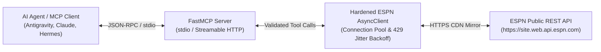

# 📦 mcp-server-espn

[](https://github.com/christianclaudio/mcp-server-espn/actions/workflows/ci.yml)
[](https://pypi.org/project/mcp-server-espn/)
[](https://pypi.org/project/mcp-server-espn/)
[](https://opensource.org/licenses/Apache-2.0)
[](https://github.com/christianclaudio/mcp-server-espn)

> **Enterprise-grade Model Context Protocol (MCP) server for live and historical sports analytics, consensus betting odds, and predictions via ESPN.**  
> Built for autonomous agents executing live sports analysis, odds comparisons, and prediction market trading (e.g. against Kalshi, Polymarket).

---

## 🏗️ Architecture



---

## 🛠️ Tool Suite (10 Tools)

All tools implement explicit MCP 2.0 annotations (`readOnlyHint=True`, `idempotentHint=True`):

| Tool | Parameters | Description |
| :--- | :--- | :--- |
| `get_scoreboard` | `sport`, `league`, `date`, `week`, `season_type`, `group`, `limit` | Live scores, state (`pre`/`in`/`post`), period/clock, TV broadcasts, starting pitchers/probables. |
| `get_game_summary` | `sport`, `league`, `event_id` | Consensus betting lines (DraftKings, Caesars, ESPN BET), matchup predictor, live win probability curve, season head-to-head series, momentum (last 5 games), injuries. |
| `get_player_stats` | `sport`, `league`, `event_id` | Boxscore statistics for individual athletes (batting, pitching, passing, rushing, receiving, scoring). |
| `get_standings` | `sport`, `league`, `season` | Division, conference, and overall league standings, win-loss records, games back, and win percentages. |
| `get_news` | `sport`, `league`, `limit` | Recent news headlines, injury designations, and breaking roster analysis. |
| `get_rankings` | `sport`, `league` | Top 25 national polls and rankings (AP Top 25, Coaches Poll, College Football Playoff). |
| `get_team_roster` | `sport`, `league`, `team_id` | Full active roster grouped by position, jersey numbers, experience, and injury status. |
| `get_team_depth_chart` | `sport`, `league`, `team_id` | Positional starter/backup hierarchy (QB1, QB2, RB1, RB2) to model injury substitution impacts. |
| `get_team_schedule` | `sport`, `league`, `team_id`, `season` | Full regular season and postseason schedule with historical game results and scores. |
| `get_athlete_overview` | `sport`, `league`, `athlete_id` | Athlete biographical info, season/career split statistics, recent game logs, next game, and rotowire notes. |

---

## ⚙️ Configuration

| Variable | Default | Description |
| :--- | :--- | :--- |
| `ESPN_BASE_URL` | `https://site.web.api.espn.com` | Target ESPN REST CDN base URL (bypasses Akamai TLS filter) |
| `ESPN_TIMEOUT_SECONDS` | `30.0` | HTTP request timeout in seconds |
| `ESPN_MAX_RETRIES` | `3` | Maximum retry attempts with jittered exponential backoff |
| `ESPN_MCP_READONLY` | `0` | Restrict server strictly to read-only inspection tools |

---

## 💻 Client Configuration

### Claude Desktop / Antigravity (`mcp_config.json`)
```json
{
  "mcpServers": {
    "espn": {
      "command": "uvx",
      "args": ["mcp-server-espn"],
      "lazy": true
    }
  }
}
```

### Local Development Command
```bash
# Run over stdio
python -m espn_mcp.server

# Run over modern Streamable HTTP
python -m espn_mcp.server --transport streamable-http --port 8000
```

---

## 🧪 Verification & Quality Gates

```bash
# Run unit tests (100% statement coverage enforced)
pytest

# Static type safety & formatting
mypy --strict src/
ruff check --fix .
ruff format .

# Tool contract & drift audits
python scripts/check_tool_contract.py
python scripts/check_openapi_drift.py
python scripts/smoke_test.py
```

---

## 📄 License

Licensed under the **Apache License 2.0**. See [`LICENSE`](LICENSE) for details.

