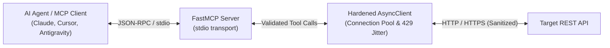

# 📦 mcp-server-template

[](https://github.com/christianclaudio/mcp-server-template/actions/workflows/ci.yml)
[](https://pypi.org/project/mcp-server-template/)
[](https://pypi.org/project/mcp-server-template/)
[](https://opensource.org/licenses/Apache-2.0)
[](https://github.com/christianclaudio/mcp-server-template)
[](https://coderabbit.ai)

> **Enterprise-grade Model Context Protocol (MCP) server template.**  
> Provides a hardened, production-ready blueprint with static typing (`mypy --strict`), 100% statement coverage, single-delete & bulk safety gates, and automated multi-channel OIDC release workflows.

---

## 🏗️ Architecture



---

## 🚀 Key Features

* **MCP 2.0 Annotations**: Every tool declares explicit `readOnlyHint`, `destructiveHint`, `idempotentHint`, and `openWorldHint` flags.
* **Safety by Default**:
  * Mandatory `confirm: bool = False` confirmation gate on single-record deletions.
  * Bulk destructive operations gated behind `TEMPLATE_MCP_ALLOW_BULK_DESTRUCTIVE=1` and `dry_run=True` defaults.
  * Global `TEMPLATE_MCP_READONLY=1` runtime toggle restricting startup strictly to safe query tools.
* **Secret Redaction**: Automated regex scrubbing (`_redact_secrets`) for Bearer tokens, API keys, and client secrets in all error traces.
* **Path Traversal Protection**: Parametric path sanitization (`urllib.parse.quote(seg, safe="")`).
* **Multi-Channel Distribution**:
  * **PyPI**: Tokenless GitHub Actions OIDC Trusted Publishing.
  * **Official MCP Registry**: Automated `server.json` publishing via `mcp-publisher`.
  * **Docker (GHCR)**: Multi-tag container builds (`ghcr.io/christianclaudio/<name>`).
  * **GitHub Releases**: CycloneDX SBOM (`sbom.cdx.json`) and cryptographic build provenance attestations.

---

## ⚙️ Configuration

| Variable | Default | Description |
| :--- | :--- | :--- |
| `TEMPLATE_API_KEY` | `""` | Service API token for authentication |
| `TEMPLATE_BASE_URL` | `https://api.example.com` | Target REST API base URL |
| `TEMPLATE_MCP_READONLY` | `0` | Restrict server strictly to read-only tools |
| `TEMPLATE_MCP_ALLOW_BULK_DESTRUCTIVE` | `0` | Unlock batch destructive mutations |

---

## 🏃 Local Development & Verification

```bash
# 1. Install dependencies
uv pip install -e ".[dev]"

# 2. Run unit tests with 100% coverage requirement
pytest

# 3. Static type checks & linting
mypy --strict src/
ruff check .
ruff format --check .

# 4. Tool contract & drift assertions
python scripts/check_tool_contract.py
python scripts/check_openapi_drift.py
python scripts/smoke_test.py
```

---

## 📄 License

Licensed under the **Apache License 2.0**. See [`LICENSE`](LICENSE) for details.
